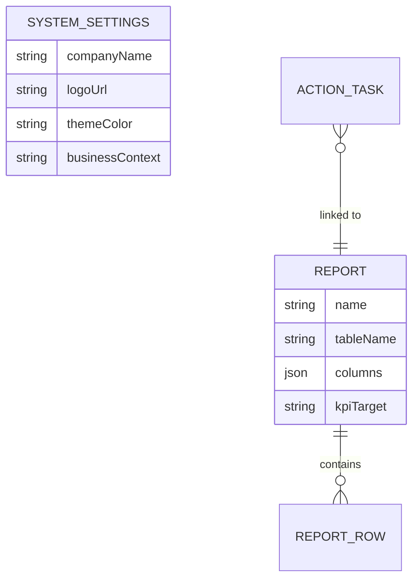

# Design Doc: White-label AI Onboarding & System Generalization

## Overview
The goal is to transform the "OneConductor-specific" project into a versatile, independent corporate solution that any company can easily adopt and customize. This will be achieved through a **White-label Architecture** and an **AI-driven Generative Onboarding** system.

## Core Pillars

### 1. System Generalization (White-labeling)
- **Problem**: Company-specific information like name, logo, and mock data are hardcoded.
- **Solution**: 
    - Create a `system_settings` table to store `companyName`, `logoUrl`, `themeColor`, and `businessContext`.
    - Implement a `BrandingProvider` (React Context) to inject these values into UI components (Sidebar, PageHeader, etc.).
    - Replace hardcoded mock data in components like `TimelineFeed` with real data from `activity_log` or `action_task` tables.

### 2. AI-driven Generative Onboarding (Hybrid Blueprint)
- **Phase 1: Identity & Goal Sync**:
    - Users provide basic company info and answer AI-led interview questions about their business goals (e.g., "Reduce defect rates", "Automate expense reporting").
- **Phase 2: Data Blueprinting**:
    - Users upload existing Excel files. AI (Gemini) maps these spreadsheets to structured `Report` definitions and creates physical DB tables automatically.
- **Phase 3: Intelligence Injection**:
    - Based on the company's goals and uploaded data, AI automatically scaffolds `input_guardrail` (validation rules) and `workflow_template` (automated actions/notifications).

## Technical Architecture

### 1. Data Model Extension

### 2. Gen-AI Orchestration
- **Architect Prompt**: Focused on parsing Excel metadata and generating SQL-ready schema JSON.
- **Strategist Prompt**: Focused on mapping business goals to Workflow Steering Hub logic and Guardrail priorities.

### 3. Progressive Onboarding UI
- A multi-step setup wizard implemented as a standalone route (e.g., `/setup`) that triggers only if `system_settings` is empty.

## Success Criteria
1.  No occurrences of "원컨덕터" or "OneConductor" in the core source code.
2.  A new corporate user can go from "Empty Installation" to a "Functioning AI Dashboard" by simply uploading an Excel file and answering 3-5 AI questions.
3.  The UI (Logo/Color) updates instantly based on DB-stored settings.
